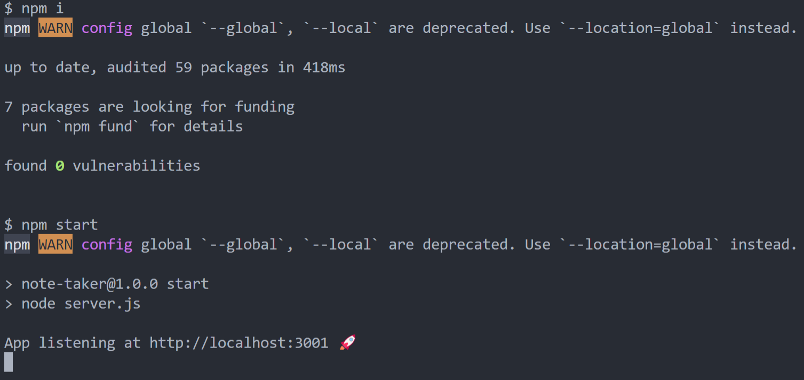
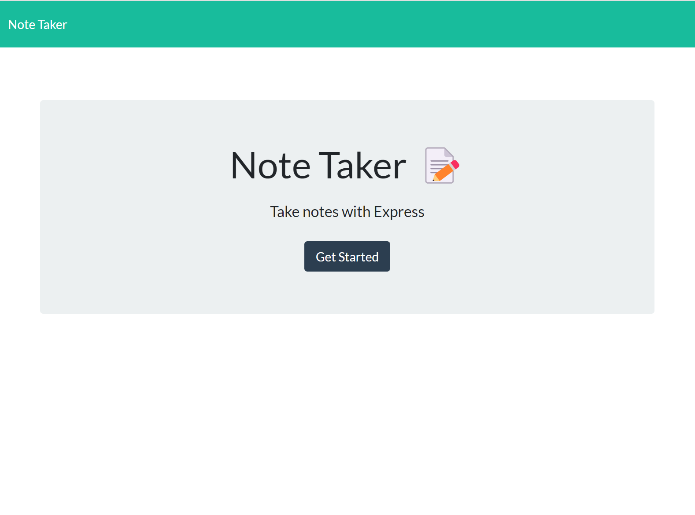
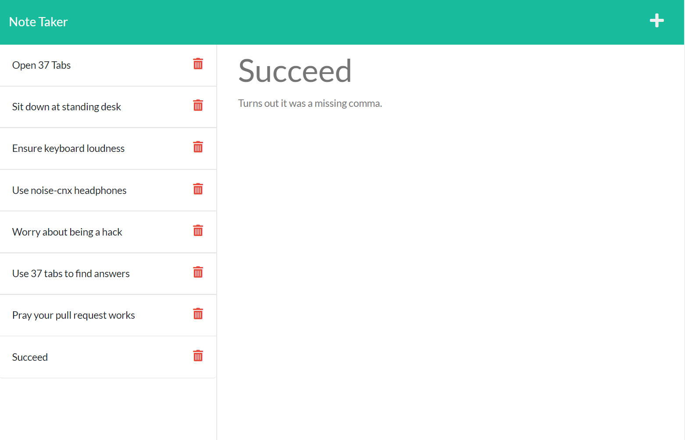

# Note Taker powered by Express
[](https://opensource.org/licenses/MIT)  

## Description  

The purpose of this is to create an app that allows the user to keep notes. Its functionality will include the ability to save and delete persistant data.

**User Story**
```
AS A small business owner
I WANT to be able to write and save notes
SO THAT I can organize my thoughts and keep track of tasks I need to complete
```

**Acceptance Criteria**
```
GIVEN a note-taking application
WHEN I open the Note Taker
THEN I am presented with a landing page with a link to a notes page
WHEN I click on the link to the notes page
THEN I am presented with a page with existing notes listed in the left-hand column, plus empty fields to enter a new note title and the note’s text in the right-hand column
WHEN I enter a new note title and the note’s text
THEN a Save icon appears in the navigation at the top of the page
WHEN I click on the Save icon
THEN the new note I have entered is saved and appears in the left-hand column with the other existing notes
WHEN I click on an existing note in the list in the left-hand column
THEN that note appears in the right-hand column
WHEN I click on the Write icon in the navigation at the top of the page
THEN I am presented with empty fields to enter a new note title and the note’s text in the right-hand column
```

## Table of Contents  
1. [Description](#description)  
2. [Installation](#installation)  
3. [Usage](#usage)  
4. [Questions](#questions)  
5. [Contributing](#contributing)  
6. [Tests](#tests)  
7. [License](#license)
## Installation  

1. Download. 
2. Run ```npm i``` from the terminal while in the folder location. 
3. Enter the command ```npm start```.  

## Usage  

**[Sample of deployed Application on Heroku](heroku_placeholder)**

 

 

 

## Contributing  

Follow best practices for naming conventions, indentation, quality comments, etc.  

## Tests  

Adding notes should update the array in ```./db/db.json``` with an object containing the new notes title, text, and a unique id. It should also log a POST and GET request in the terminal.
Deleting a note should remove an object from the array in ```./db/db.json``` based on the notes ID. It should also log a DELETE and GET request in the terminal.

## Questions  

If you have any questions, please reach out to me either ong Github or by Email.
  - **Github:** [mmelan000](https://github.com/mmelan000)
  - **Email:** [m.melanson000@gmail.com](mailto:m.melanson000@gmail.com)

## License  

- [MIT](https://opensource.org/licenses/MIT)